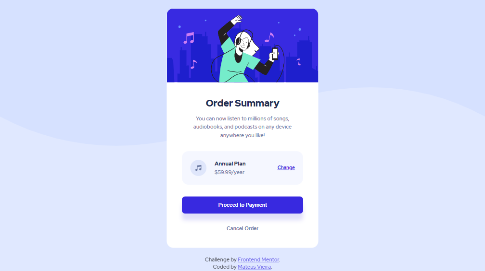
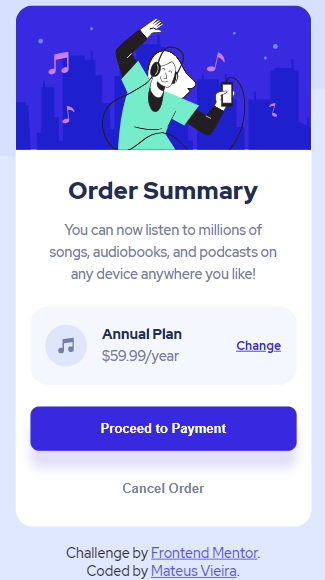

# Frontend Mentor - Order summary card solution

This is a solution to the [Order summary card challenge on Frontend Mentor](https://www.frontendmentor.io/challenges/order-summary-component-QlPmajDUj). Frontend Mentor challenges help you improve your coding skills by building realistic projects. 

## Table of contents

- [Frontend Mentor - Order summary card solution](#frontend-mentor---order-summary-card-solution)
  - [Table of contents](#table-of-contents)
  - [Overview](#overview)
    - [The challenge](#the-challenge)
    - [Screenshot](#screenshot)
    - [Links](#links)
  - [My process](#my-process)
    - [Built with](#built-with)
    - [What I learned](#what-i-learned)
    - [Useful resources](#useful-resources)
  - [Author](#author)

## Overview

### The challenge

Users should be able to:

- See hover states for interactive elements

### Screenshot

- Desktop

<p align="center"></p>

- Mobile

<p align="center"></p>

### Links

- <a href="https://mateusvrs.github.io/order-summary-component-main/">Solution Site</a>

## My process

### Built with

- Semantic HTML5 markup
- CSS custom properties
- Google Fonts
- Flexbox
- CSS Grid

### What I learned

- HTML - Input (type="button")
```html
          <div class="buttons">
            <input type="button" value="Proceed to Payment" id="payment-btn">
            <input type="button" value="Cancel Order" id="cancel-btn">
          </div>
```

### Useful resources

- [MDN](https://developer.mozilla.org/en-US/docs/Web/HTML/Element/Input/button) - This helped me for learn about HTML Input (type="button").

## Author

- Instagram - [@mateusvrs](https://www.instagram.com/mateusvrs)
- Linkedin - [@mateusvrs](https://www.linkedin.com/in/mateusvrs/)
